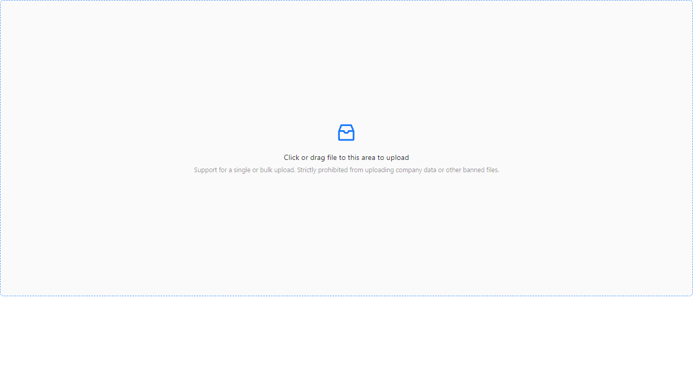

# tinyDown
一个简化版本的上传下载功能，方便部署到服务器上进行操作

## 上传
默认 上传页面 http://127.0.0.1:7654/

拖拉文件即可，文件会保存在 此项目的 file  目录下，同名会覆盖。

## 下载

http://127.0.0.1:7654/home/down?file=/data/xxx.txt&key=xxxx
按照以上方式拼接就会简单的下载文件了。使用方便

## 部署方式

windows上部署方式很多，linux上，可以通过 chmod + x InitServer.sh   然后运行 ./InitServer.sh 即可搭建服务